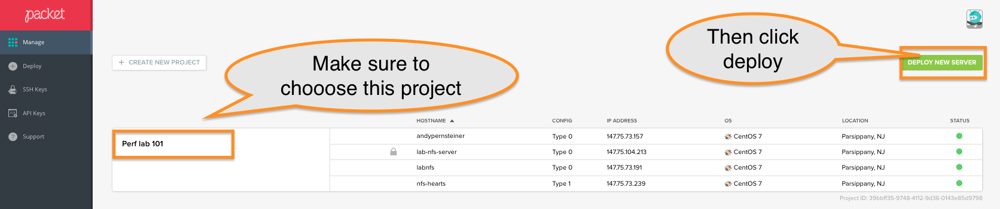
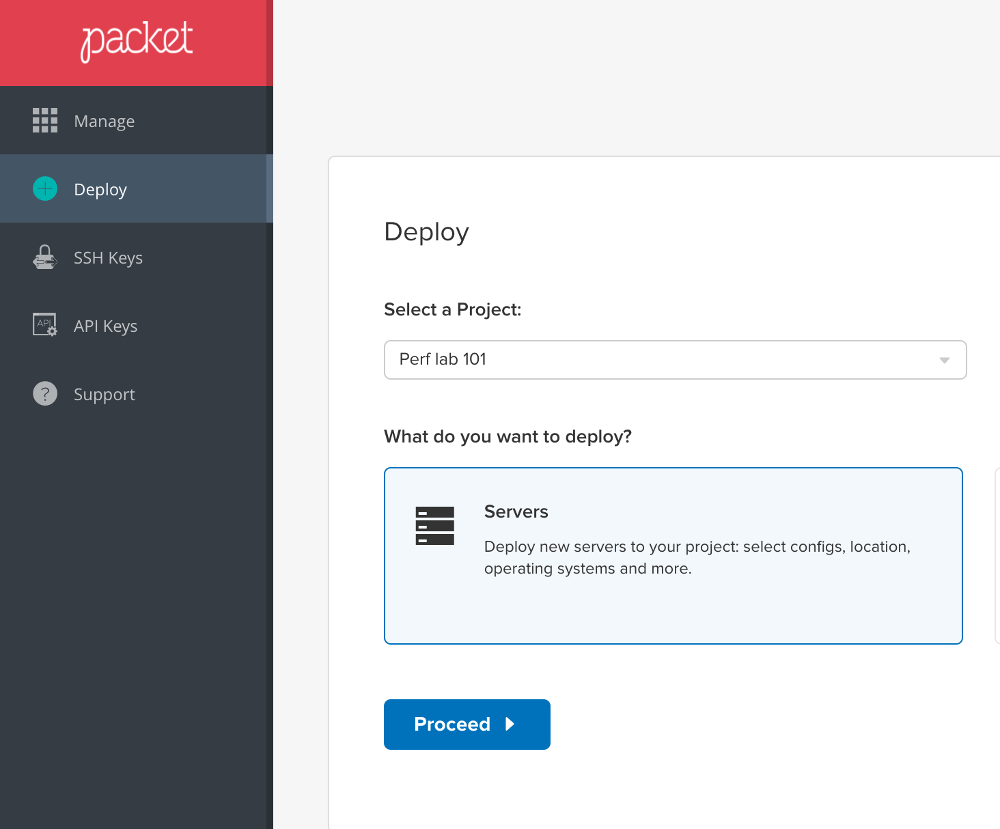
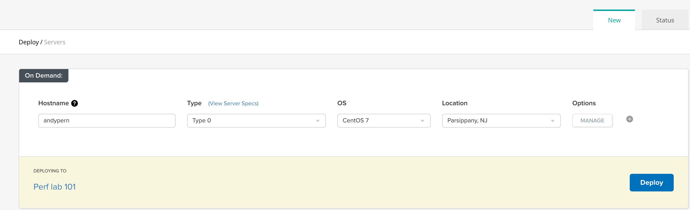
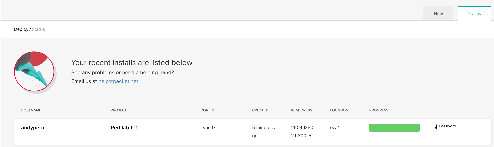
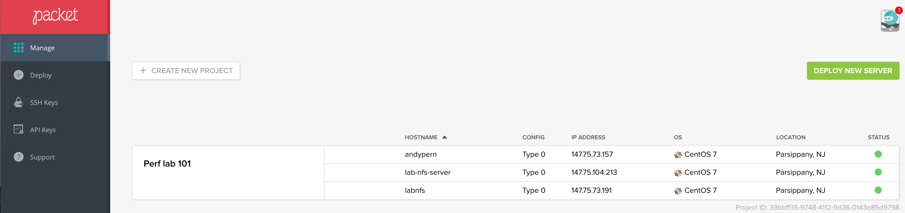
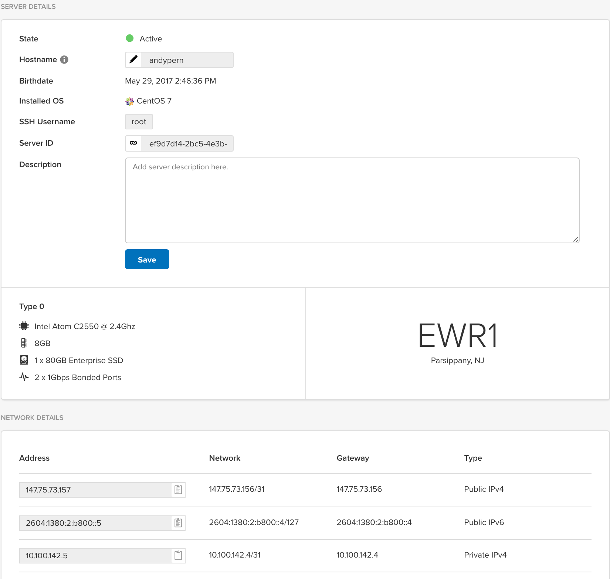

Performance basics lab
====================================

Goals
-----


This is a basics lab, meaning for some of you, it will probably be pretty rudimentary.  That said, here are things you should be able to take away at the conclusion of this excercise:

* You will be able to provision instances on Packet.net
* Unix tools to obtain configuration and environmental details about a host
* Tools to test connectivity to other hosts
* Tools and methods to test filesystem performance
* Basic techniques to flush caches and script simple tests
* Observe behavior of applying different parameters (block size & fileSize) during a test 


Environment
-----

Packet.net has graciously provided the infrastructure which will allow you to spinup linux instances for these excercises.  On your way into today's meetup, you will have provided your email address, in exchange for a playing card.  

***Do not lose this card: you need it for the lab, and you'll want to keep it for a chance to win a $50 Amazon gift card!***

Go ahead and check your email, and look for either an invitation to join an existing project, or for a link to setup a new account with Packet.net.  

You will not be charged for anything you do today, as it will all be governed by the project we created for this lab.  Packet is also providing you with an INVITE code which gives you $25 of free credits, which are yours to use!  That's enough for approximately 3 weeks of `type0` server time, running 24x7.

code: `INVITE25`  


Lab instructions
------------

### setup your instance (10-15 mins)

To get started, you'll want to spin up a single linux instance.  For consistency sake, we recommend that you choose CentOS 7 for your operating system

1.  Login to www.packet.net
	* ***If you do not have a login, please talk to one of the lab helpers to get you setup***
2. Click `Manage`

3. Select `Perf lab 101`  
	* ***if this project does not show up for you, talk to one of the lab helpers to get your account added to this project.***
	

	
4.  Click `Deploy New Server`
5. Again, make sure the right project is chosen, make sure `Servers` is selected, and click `Proceed`

	

5. Server details
	* For `Hostname` , put in your username (without the @domain.com).  Its important that you use something that will be unique from the other participants, so if in doubt, use firstInitialLastName, eg: `apernsteiner`
	* For `Type` , choose `Type 0`
	* For `OS` , choose `CentOS 7`
	* For `Location` , choose `Parsippany, NJ`
	* Click `Options/Manage`, and specify the Root user ssh keys. Note that you may already have an SSH key defined, in which case you can skip
	* Click `Deploy`
	
	
6.  Deploy typically takes 5-10 minutes, to get your very own bare-metal server.
	


While you are waiting, you can take this time to browse Packet.net's console, to get an understanding of the infrastructure and services offered.  

***Note: please do not modify or delete any existing instances in this project, as you will impact other participants!***

### connect to your instance (1-2 mins)

Once things are up, you should see the progress bar on the `Deploy` page change from yellow to green.  



If you do not see anything show up on the `Deploy` page, it likely means that your instance has successfully been provisioned, in which case you can find it on the `Manage` panel:

 

You can now click on the instance hostname to get additional details about it.  Primarily you care about the `Network details` section.

 

Once you have your IP address, which should look something like `147.75.73.xx` , open up your terminal application (Putty on Windows, Terminal on OSX) and ssh as the root user:

		ssh root@147.75.73.xx
		
If you are prompted for a password, it means your SSH key isn't setup either on the instance, or on your laptop.  If that's the case, please raise your hand and a friendly lab helper will get you sorted out.  If you want to sort it out on your own, refer to this documentation:

* [generate-ssh-keys](https://help.packet.net/quick-start/generate-ssh-keys)
* [ssh-access](https://help.packet.net/technical/infrastructure/ssh-access)

Once you are in, you should see a prompt like this:

	➜  linux ssh root@147.75.73.157
	The authenticity of host '147.75.73.157 (147.75.73.157)' can't be established.
	ECDSA key fingerprint is SHA256:RF63yOA+iUl2F8qUStiK/sVYYe9atH3mGnjymQD3yNQ.
	Are you sure you want to continue connecting (yes/no)? yes
	Warning: Permanently added '147.75.73.157' (ECDSA) to the list of known hosts.
	[root@andypern ~]#

**If for some reason you get stuck at any point along the way, don't be shy: raise your hand to get the attention of a lab helper, or ask your friendly neighbor for help :)**


### instance environmentals 

Whenever you are either troubleshooting an issue, or are wanting to benchmark performance, its always a good idea to first make sure you understand as many details as possible about the host you are on.  This section of the lab focuses on basics, such as networking and mounted filesystems.

#### Determine network details of your instance (2-3 mins)


1. Get info about all network interfaces
	
		    ifconfig -a
		
	You've probably used this tool many times, but how often do you pay attention to every field?  You can easily use it to get things like:
	
    * list of interfaces (look for `bond0` , `eth0` , etc)
	* IP address(es), subnet mask
	* MTU size (this will be important in future labs)
	* any RX/TX errors
	* Total bytes & packets sent through each interface
	
	Get a list of currently listening IP addresses on your instance via:
		
			    ifconfig -a | grep inet
	***Note: you may notice that you see more than one IP address for your instance.  This is normal, as your instance has both a Public (Internet facing) and Private (internal packet.net facing) address.  Make a note of both of them***


2.  connection type and speed of ifaces

	The `ethtool` utility is installed on most linux variants by default, however the fields which are displayed may vary from version to version.
	
	The simplest incantation is:
	
		    ethtool eth0 
	
	You can replace `eth0` with `bond0`, or `bond0:0`.  Experiment with this and see what you find.  
	
	You can also determine the network driver being used by an interface via:
	
	        ethtool -i eth0
	
	This is useful for ensuring that your interface is running a current version of the driver, and can also help identify the vendor.  Another quick way to determine vendor is via:
	
	        lspci | grep Ethernet
	
	Note that ethtool usage can vary from system to system, you'll want to experiment on other systems to make sure you know what to expect.  This tool is useful to make sure you know:
	
	* Link detected?
	* fiber/copper 
	* Negotiated speed 
	
	More advanced uses include setting interface specific parameters such as flow control, tcp-segment-offload, and more.  Be careful when using flags which can change settings, as they may not always do what you expect... for this lab, you won't be changing any settings, just observing them.


3.  What fileSystems are mounted
	 In the excercise today, we'll be focusing on locally and NFS mounted filesystems.  The `mount` command, when run with no options shows the filesystems which are mounted to your instance, and some details about them.  The `df` command shows slightly different details, including the amount of space free/available. 
	    
		    mount
    and df:
	
		    df -h
	
	**Note: in some cases, the `df` command can hang, especially when there is a stale NFS mount.  In those scenarios, the `mount` command is advised, since it will not cause the system to attempt to query the remote filesystem, and will not get hung** 

4.  OS related details
	Its also nice to know what type of OS you are on.  When on RHEL & variants (CentOS , Scientific-Linux, and of course RHEL), you can run:
	
	        cat /etc/redhat-release
	
    On most unix/linux distro's, you can determine the kernel version and other details via:
	    
	        uname -a
	    
	        

### Set some quick environmental variables

To make life a little easier, set some environmental variables for yourself.  In order to persist them (so that you don't have to reset them every time you login to your instance), put them in your .bashrc file.  Run the following commands to do so (make sure to use double quotes (`""`) when specified, as single quotes (`''`) may cause variables to get escaped.

1. ` NFS_SERVER_IP`:

	When you walked in the room, you should have picked up a playing card.  Not only is this card your chance to win a prize, but you also need it to determine what NFS server to use.  Depending on which card you have, copy/paste the appropriate command:
	***Important: ONLY paste the line which corresponds to the card you were issued!***
	
	* Hearts:
	
			echo "export NFS_SERVER_IP=10.100.142.7" >> /root/.bashrc 
	* Diamonds:
	
			echo "export NFS_SERVER_IP=10.100.142.9" >> /root/.bashrc 
	
	* Clubs:
	
			echo "export NFS_SERVER_IP=10.100.142.11" >> /root/.bashrc
	
	* Spades:
	
			echo "export NFS_SERVER_IP=10.100.142.13" >> /root/.bashrc

2.  When you are done appending variables to your .bashrc file, run the following to ensure that they are available for your current session, you should not need to do this again (unless you add or change things in .bashrc):

		source /root/.bashrc
		
3.  Verify that they took:

		env|grep NFS
	output should be:
	
		NFS_SERVER_IP=10.100.x.x
 
### Fileserver environmental discovery (~5 mins)

The fileserver you will be mounting an NFS server, also running Centos-7.  

Any time you are working on a remote fileserver, its a good idea to determine connectivity between it and your host.  

1.  route to fileserver
	
	Its important to know what interface and gateway will be used when you connect to the fileserver, especially in the case when your host has multiple interfaces.

	     ip route get $NFS_SERVER_IP
     output, which shows the target address, gateway, interface, and source address:
	
	     10.100.142.x via 10.100.142.4 dev bond0  src 10.100.142.5

	Another tool you can use is the 'traceroute' utility:

	    traceroute $NFS_SERVER_IP

2.  latency to fileserver
    
	    ping -c 5 $NFS_SERVER_IP

    
3.  Determine what exports are available

	Before you mount a fileserver, you need to know what mounts are available.  Note that some NFS servers and vendor specific appliances (such as Netapp) can obfuscate NFS exports, so the following command may not show all that are available.  

	    showmount -e $NFS_SERVER_IP 

4.  Mount the NFS server

    first make a directory locally where you will mount to:

	    mkdir /mnt/nfs
    Then mount:

	    mount -t nfs -o tcp,rw,vers=3 $NFS_SERVER_IP:/export /mnt/nfs 

	We'll save more indepth discussion of NFS mount opts for another session, as there are cases where you will want to experiment with things like rsize/wsize, readahead, and others.  For now, we want to make sure we're using TCP as the transport (as oppoed to UDP), and NFSv3 (as opposed to the default in RHEL-7, which is now NFSv4). 

5.  Verify mount

	    df -h | grep export 
    output:
    
	    10.100.142.x:/export  218G  1.3G  206G   1% /mnt/nfs
    or:
    
	    mount | grep export

    output:
    
	    10.100.142.x:/export on /mnt/nfs type nfs (rw,relatime,vers=3,rsize=1048576,wsize=1048576,namlen=255,hard,proto=tcp,timeo=600,retrans=2,sec=sys,mountaddr=10.100.142.x,mountvers=3,mountport=20048,mountproto=tcp,local_lock=none,addr=10.100.142.x)

	Note that the `mount` command will show you some additional options, including some that you did not specify.  These represent defaults for your system/OS.  Any time you are running tests or cataloging an environment, its important to make note of which mount options are in use for accurate and valid reproduction of results and issues.  We'll cover some additional detail on NFS mount options in a future lab.

6.  Its nice to have NFS servers in your `/etc/fstab` so that you can remount them later without having to specify the full mount command.  To do this, just run the following command:

		echo "$NFS_SERVER_IP:/export /mnt/nfs nfs rsize=32768,wsize=32768,proto=tcp,hard,rw,vers=3 0 0" >> /etc/fstab

7.  Verify that your addition took, and that it shows the proper IP via:

		tail -n 1 /etc/fstab
	output:
	
		10.100.142.x:/export /mnt/nfs nfs rsize=32768,wsize=32768,proto=tcp,hard,rw,vers=3 0 0

8.  Unmount & remount the NFS server so that it uses your fstab additions via:

        umount -lf /mnt/nfs && mount /mnt/nfs

9.  Verify:

        mount | grep export


#### Basic File System tests (~10-15 mins)
Now that you have an NFS server mounted, you want to ensure that you can Create/read/write and delete files. 

1.  First, create a directory for yourself.  The following command will create a directory on the NFS server to match your instance's hostname:

		mkdir -p /mnt/nfs/$HOSTNAME

    verify:
        
        ls -ld /mnt/nfs/$HOSTNAME
    output:

        drwxr-xr-x 2 root root 4096 May 29 20:12 /mnt/nfs/andypern


2.  Make a 0byte file, just to validate you can:
        
        touch /mnt/nfs/$HOSTNAME/testfile
        
	Its useful to follow this with `ls -l /mnt/nfs/$HOSTNAME/testfile` which will tell you:
	* the user/group that you are being mapped to (helpful if you are troubleshooting root-squash issues)
	* The effective umask/default permisions of new files


3.  Write a 100MB file
	We'll use the `dd` command here, which is a simple way to create files of varying length quickly.  `dd` is installed on nearly every linux, unix, and BSD variant, so you should be able to use it most places you go.  Note that in some cases, the options will vary, for instance, on BSD (which includes OSX), you need to specify lowercase 'm, b, g' for 'megabytes, bytes, gigabytes, and kilobytes'.  On some linux variants, you will specify upper-case letters for those units.
	
	The following command creates a 100MB file, using 1 Megabyte block sizes, `/dev/zero` as the input, and a new file on the NFS server as the output.         


	    dd if=/dev/zero of=/mnt/nfs/$HOSTNAME/100MB.file bs=1M count=100

    * How fast did it go?
    * What if you re-write the same file, faster or slower, or the same?

3.  Read back the 100MB file

        dd if=/mnt/nfs/$HOSTNAME/100MB.file of=/dev/null bs=1M
        
    * How fast did it go?
    * does that seem realistic..?

4.  Flush client side cache

	When dealing with both local and NFS mounted filesystems, the linux page cache is utilized, and can cause misleading results.  For instance, when performing a WRITE to an NFS server, this cache is populated, such that subsequent reads will be read from cache, which lives in local RAM.  Therefore, if you are trying to get an accurate reading of performance, its critical to flush this client-side cache between operations.
	
	On linux, there are (at least) two ways to do this:
	    
    * Without remounting:
    
            echo 3 > /proc/sys/vm/drop_caches
    * By unmounting & remounting:
    		 
		    umount -lf /mnt/nfs && mount /mnt/nfs
	
		**Note that unmounting/remounting can cause other operations from this client to have issues against the NFS server, so its typically only recommended to do this on hosts that are exclusively for your own use.  Using the former option of dropping the cache is preferred, but also can have impact to application performance because it is a system wide operation, effectively flushing the entire linux page cache.**

5.  Re-run your read test

        dd if=/mnt/nfs/$HOSTNAME/100MB.file of=/dev/null bs=1M

    * Speed change?

	***Keep in mind: even though the client cache is flushed, the NFS server cache may be giving you results which aren't realistic.***

6.  Try a bigger file:

        dd if=/dev/zero of=/mnt/nfs/$HOSTNAME/2GB.file bs=1M count=2048

	Then flush:

        echo 3 > /proc/sys/vm/drop_caches
    And read:
    
        dd if=/mnt/nfs/$HOSTNAME/2GB.file of=/dev/null bs=1M


#### Advanced File System tests (~10-15 mins)

1.  Vary block size in DD

	So far you've just done testing with relatively large block sizes (1MB).  However, in the real world things don't typically line up this way.  For instance, many databases (such as postgres/mysql) will use much smaller units, such as 4K or 8K.  You can experiment and see how different block sizes behave. 
	
	eg:
	
	    dd if=/dev/zero of=/mnt/nfs/$HOSTNAME/mysql.dat bs=2K count=$((1024*1024))
	
	This will make a 2GB file, using 2Kilobyte block sizes.
	
	Note that in some cases, you may not see a large difference in performance when changing the block size.  There are a number of reasons for this, one being that for sequential operations, NFS clients will batch up requests instead of sending each 2KB write request across the wire separately.  That's where the 'wsize' option comes in.  If you want to see what happens when 'actual' 2K requests traverse the wire, you'll want to modify your `/etc/fstab` entry for your NFS server and modify the rsize and wsize as folows:
	
		rsize=2048,wsize=2048
		
	***Note: this assumes you know how to use a text editor, such as `vi` or `vim` : if you don't know how to use `vi`, you can install `nano` via***:
	
		yum install -y nano	
		
	Once you modify `/etc/fstab`, run the following to flush cache and remount:
	
		umount -lf /mnt/nfs && mount /mnt/nfs
		
	You can verify that your settings took by running the following:
	
		mount | grep nfs
	
	Now remove the file:
	
	    rm /mnt/nfs/$HOSTNAME/mysql.dat
	
	And try again:
	
	    dd if=/dev/zero of=/mnt/nfs/$HOSTNAME/mysql.dat bs=2K count=$((1024*1024))
	
	Notice the difference?
	
		

2.  The 'direct' flag
What if you want to bypass the client cache for reads & writes?  Also..what if you want the client to send a separate request for each 2K write request?  On linux, you have the 'direct' flag, which does a few things:

    * Bypasses the client side writeback cache
    * Forces each 2K call to be sent across the wire, instead of being coalesced up to the client's `wsize`
    * Alerts the NFS server that the client wishes every WRITE call to be committed to stable storage before the server responds saying "all clear".  On some NFS servers, this means it has to be committed to physical disk, on others, NvRAM is used to buffer stable writes.

To do this, lets first change our client-side mount opts back to their 32K defaults, in /etc/fstab:

        rsize=32768,wsize=32768

Umount/remount:

        umount -lf /mnt/nfs && mount /mnt/nfs

Verify :

        mount | grep export

Now write a new file, note that we are going to specify only a 20MB file, because this can take a LONG time otherwise:

	        dd if=/dev/zero of=/mnt/nfs/$HOSTNAME/mysql.direct.dat bs=2K count=$((20*1024)) oflag=direct

Notice the speed delta between buffered and non-buffered writes.  We'll explore this in a little more detail in a future lab.
        

3.  Adding concurrency
This will be covered in more detail in a future lab, but consider that many real world scenarios involve a number of clients performing operations against a server simultaneously.  Unfortunately, DD is relatively limited in this nature, and to do proper testing, one must employ tools which are more centered around benchmarking.  However, you can do some simple tests with just DD:

```
    for i in `seq 2`
        do dd if=/dev/zero of=/mnt/nfs/$HOSTNAME/multithread_${i} bs=1M count=1024 & 
    done
```

This launches 2 DD threads into the background.  You won't get an aggregate result from them, rather you'll get two individual results, but its a start.  Try varying the threadcount from 2 -> 10 and see what you get..

***Note: your shell will return immediately when you launch this command.  However, you will see output in your shell after each thread completes***

4.  Using 'random' data
Using /dev/zero is typically the fastest method of generating synthetic data on a unix system, however there are some situations where it is not advisable to use.  In particular, if the target filesystem has inline compression, deduplication, or both: `/dev/zero` can produce invalid results, as the 'zeros' it writes can be compressed or deduplicated significantly, reducing I/O on the target storage subsystem.  In those cases, you'll want to use `/dev/urandom`.  However, because this device requires more CPU to generate data, it can introduce its own performance bottleneck into your test.  Because of this, its advisable to first write random data to a RAM disk or TMPFS.

    1.  Check to see if /dev/shm is mounted, as well as how much space is available:

	        df -h | grep shm
    
    2.  Create a file in `/dev/shm` that is less than the available space:
    ***this might take 5 minutes to complete. if you would prefer, use a smaller `count`***

            dd if=/dev/urandom of=/dev/shm/1GB.file bs=1M count=1024  

    3.  Run your test, this time using your created file as the input:

            dd if=/dev/shm/1GB.file of=/mnt/nfs/$HOSTNAME/1GB.random bs=1M 

## Other useful tools

When you are doing performance testing and profiling, it can be nice to monitor various aspects of the system you are on in order to get a sense for what's happening.  Linux uses /proc to provide these statistics from the kernel, and there are a number of tools available which consume this information and present it in a human readable way.  Here are some which I use on a daily basis:

* dstat : gives nice, colorized output of various stats, has a lot of options to control output.  Word of warning: because of how `dstat` samples `/proc` , you may find that the throughput numbers seem a little off at times.
* iostat
* sar
* tmux : similar to `screen` , `tmux` makes life easier when you have simultaneous tasks which you want to complete on a unix system.  EG: use tmux to manage 'panes' which contain tests, `dstat` output, log-tailing, and a text editor (like `vim`) with ease.
* watch : lots of times you want to re-run the same command repeatedly to `watch` for changes.  EG: you may want to `watch ls -l /mnt/nfs/$HOSTNAME/filename` to see if a file is growing.

If these commands are not available on your system, its usually just a matter of running something like:

    yum install -y dstat

    

## appendix 
For future labs:
* ping w/ don't fragment set (mtu)
* nmap to determine open ports
* 
